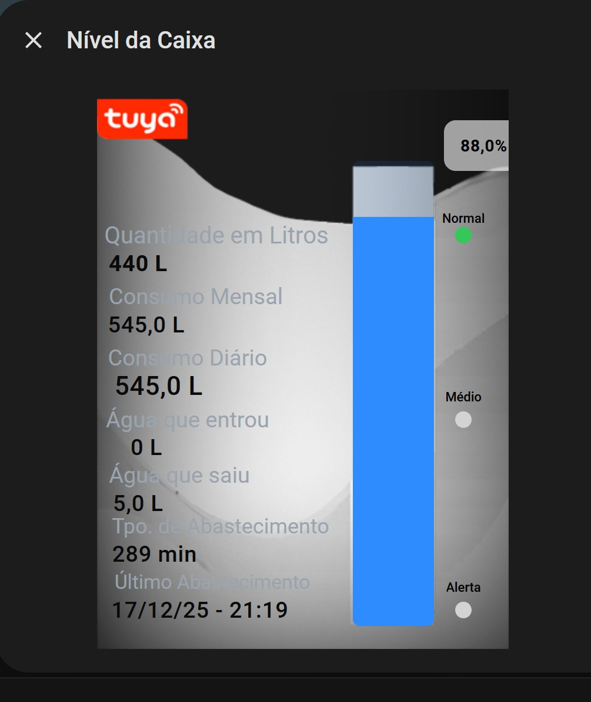

# 💧 Home Assistant – Caixa d’Água em Litros (Tuya / Smart Life)

Projeto para Home Assistant com sensores, automações e card personalizado
para controle de nível, abastecimento e histórico da caixa d’água.

---

## 📸 Visual do Card




---

## 📦 1️⃣ Conversão das MEDIDAS

✔ **Installation height**  
0,7 m = 70 cm  

✔ **Maximum liquid depth**  
0,1 m = 10 cm  


## 📦 2️⃣ Sensores Tuya (referência)

```text
number.nivel_do_tanque_a_alarm_maximum
number.nivel_do_tanque_a_alarm_minimum
sensor.nivel_do_tanque_a_liquid_level
```


## 📦 3️⃣ Sensor de LITROS (base do projeto)

📄 **sensors.yaml**

```yaml
# ==============================
# Caixa d'água - Litros
# ==============================
- platform: template
  sensors:
    caixa_agua_litros:
      friendly_name: "Caixa d'água - Litros"
      unit_of_measurement: "L"
      device_class: water
      icon_template: mdi:water
      value_template: >
        
        {{ (percentual * 5) | round(0) }}
```

**Caixa de 500 L → cada 1% = 5 L**


## 📦 4️⃣ Sensor ACUMULADOR (ENTRADA)

📄 **sensors.yaml**

```yaml
# ==============================
# Entrada total de água na caixa
# ==============================
- platform: template
  sensors:
    caixa_agua_entrada_total:
      friendly_name: "Entrada Total Caixa"
      unit_of_measurement: "L"
      device_class: water
      value_template: >
        
        
        
          {{ (states('sensor.caixa_agua_entrada_total') | float(0)) + (atual - anterior) }}
        
          {{ states('sensor.caixa_agua_entrada_total') | float(0) }}
        
```


## 📦 5️⃣ Sensor ACUMULADOR (SAÍDA / CONSUMO)

📄 **sensors.yaml**

```yaml
# ==============================
# Saída total de água da caixa
# ==============================
- platform: template
  sensors:
    caixa_agua_saida_total:
      friendly_name: "Saída Total Caixa"
      unit_of_measurement: "L"
      device_class: water
      value_template: >
        
        
        
          {{ (states('sensor.caixa_agua_saida_total') | float(0)) + (anterior - atual) }}
        
          {{ states('sensor.caixa_agua_saida_total') | float(0) }}
        
```


## 📦 6️⃣ Utility Meter

📄 **utility_meter.yaml**

```yaml
consumo_caixa_diario:
  source: sensor.caixa_agua_saida_total
  cycle: daily

consumo_caixa_mensal:
  source: sensor.caixa_agua_saida_total
  cycle: monthly

abastecimento_caixa_mensal:
  source: sensor.caixa_agua_entrada_total
  cycle: monthly
```


## 📦 7️⃣ Inputs (configuration.yaml)

```yaml
input_number:
  caixa_agua_litros_anterior:
    name: Caixa d'água Litros Anterior
    min: 0
    max: 10000
    step: 1

  litros_inicio_abastecimento:
    name: Litros início abastecimento
    min: 0
    max: 1000
    step: 1
    unit_of_measurement: "L"

  litros_fim_abastecimento:
    name: Litros fim abastecimento
    min: 0
    max: 1000
    step: 1
    unit_of_measurement: "L"

  tempo_abastecimento_caixa:
    name: Tempo Abastecimento (min)
    min: 0
    max: 300
    step: 1
    unit_of_measurement: min

input_datetime:
  inicio_abastecimento_caixa:
    name: Início Abastecimento
    has_date: true
    has_time: true

  ultimo_abastecimento_caixa:
    name: Último Abastecimento
    has_date: true
    has_time: true
```

## 📦 8️⃣ (Card Buton Pop UpCompleto)

```yaml
type: custom:button-card
template:
  - base
name: Caixa
entity: sensor.nivel_do_tanque_a_liquid_level
icon: mdi:projector-screen-variant
size: 100%
show_state: false
styles:
  card:
    - background-color: rgba(60, 60, 60, 0.3)
    - border: "0.5px solid #5c5b5b"
  name:
    - font-size: 13px
state:
  - operator: <=
    value: 20
    styles:
      icon:
        - color: "#ff3b30"
  - operator: <=
    value: 50
    styles:
      icon:
        - color: "#ffcc00"
tap_action:
  action: call-service
  service: browser_mod.sequence
  service_data:
    sequence:
      - service: script.pc_click
      - service: browser_mod.popup
        data:
          title: Nível da Caixa
          content:
            type: horizontal-stack
            cards:
              - type: custom:button-card
                styles:
                  card:
                    - width: 70px
                    - background: none
                    - box-shadow: none
                    - border: none
              - type: picture-elements
                image: /local/fundocaixa1.png
                card_mod:
                  style: |
                    ha-card {
                      background: transparent;
                      box-shadow: none;
                      border: none;
                      border-radius: 0;
                      height: 500px;
                      width: 350px;
                      overflow: hidden;
                    }
                elements:
                  - type: custom:bar-card
                    entity: sensor.nivel_do_tanque_a_liquid_level
                    direction: up
                    height: 395px
                    width: 69px
                    min: 0
                    max: 100
                    positions:
                      name: "off"
                      value: "off"
                      icon: "off"
                    style:
                      top: 56%
                      left: 72%
                      transform: translate(-50%, -50%)
                      "--bar-card-border-width": 0
                      "--bar-card-border-radius": 6px
                      "--bar-card-background": transparent
                      "--bar-card-color": "#2f8cff"
                      "--bar-card-padding": 0
                      "--bar-card-margin": 0
                      "--bar-card-shadow": none
                    card_mod:
                      style: |
                        ha-card {
                          background: transparent;
                          box-shadow: none;
                          border: none;
                        }
                  - type: custom:button-card
                    name: Quantidade em Litros
                    show_icon: false
                    show_state: false
                    styles:
                      card:
                        - background: none
                        - border: none
                      name:
                        - color: "#9aa4af"
                        - font-size: 20px
                    style:
                      top: 26%
                      left: 29%
                  - type: state-label
                    entity: sensor.caixa_agua_litros
                    style:
                      top: 31%
                      left: 10%
                      color: "#0a0a0a"
                      font-size: 19px
                      font-weight: 600
                  - type: custom:button-card
                    name: Consumo Mensal
                    show_icon: false
                    show_state: false
                    styles:
                      card:
                        - background: none
                        - border: none
                      name:
                        - color: "#9aa4af"
                        - font-size: 19px
                    style:
                      top: 37%
                      left: 24%
                  - type: state-label
                    entity: sensor.consumo_caixa_mensal
                    style:
                      top: 42%
                      left: 12%
                      color: "#0a0a0a"
                      font-size: 19px
                      font-weight: 500
                  - type: custom:button-card
                    name: Consumo Diário
                    show_icon: false
                    show_state: false
                    styles:
                      card:
                        - background: none
                        - border: none
                      name:
                        - color: "#9aa4af"
                        - font-size: 19px
                    style:
                      top: 48%
                      left: 22%
                  - type: state-label
                    entity: sensor.consumo_caixa_diario
                    style:
                      top: 53%
                      left: 15%
                      color: "#0a0a0a"
                      font-size: 22px
                      font-weight: 500
                  - type: custom:button-card
                    name: Alerta
                    show_icon: false
                    show_state: false
                    styles:
                      card:
                        - background: transparent
                        - box-shadow: none
                        - border: none
                      name:
                        - color: "#000000"
                        - font-size: 11px
                        - font-weight: 500
                    style:
                      top: 89%
                      left: 89%
                  - type: custom:button-card
                    show_name: false
                    show_state: false
                    custom_fields:
                      circle: |
                        [[[ return `<div style="
                          width:14px;
                          height:14px;
                          border-radius:50%;
                          background:${states['sensor.status_caixa_agua'].state === 'baixo'
                            ? '#ff3b30'
                            : '#d3d3d3'};
                        "></div>`; ]]]
                    styles:
                      card:
                        - background: transparent
                        - box-shadow: none
                        - border: none
                    style:
                      top: 93%
                      left: 89%
                  - type: custom:button-card
                    name: Médio
                    show_icon: false
                    show_state: false
                    styles:
                      card:
                        - background: transparent
                        - box-shadow: none
                        - border: none
                      name:
                        - color: "#000000"
                        - font-size: 11px
                        - font-weight: 500
                    style:
                      top: 55%
                      left: 89%
                  - type: custom:button-card
                    show_name: false
                    show_state: false
                    custom_fields:
                      circle: |
                        [[[ return `<div style="
                          width:14px;
                          height:14px;
                          border-radius:50%;
                          background:${states['sensor.status_caixa_agua'].state === 'medio'
                            ? '#ffcc00'
                            : '#d3d3d3'};
                        "></div>`; ]]]
                    styles:
                      card:
                        - background: transparent
                        - box-shadow: none
                        - border: none
                    style:
                      top: 59%
                      left: 89%
                  - type: custom:button-card
                    name: Normal
                    show_icon: false
                    show_state: false
                    styles:
                      card:
                        - background: transparent
                        - box-shadow: none
                        - border: none
                      name:
                        - color: "#000000"
                        - font-size: 11px
                        - font-weight: 500
                    style:
                      top: 23%
                      left: 89%
                  - type: custom:button-card
                    show_name: false
                    show_state: false
                    custom_fields:
                      circle: |
                        [[[ return `<div style="
                          width:14px;
                          height:14px;
                          border-radius:50%;
                          background:${states['sensor.status_caixa_agua'].state === 'ok'
                            ? '#34c759'
                            : '#d3d3d3'};
                        "></div>`; ]]]
                    styles:
                      card:
                        - background: transparent
                        - box-shadow: none
                        - border: none
                    style:
                      top: 26%
                      left: 89%
                  - type: custom:button-card
                    name: Água que entrou
                    show_icon: false
                    show_state: false
                    styles:
                      card:
                        - background: none
                        - border: none
                      name:
                        - color: "#9aa4af"
                        - font-size: 19px
                    style:
                      top: 59%
                      left: 22%
                  - type: state-label
                    entity: sensor.caixa_agua_entrou
                    style:
                      top: 64%
                      left: 12%
                      color: "#0a0a0a"
                      font-size: 19px
                      font-weight: 500
                  - type: custom:button-card
                    name: Água que saiu
                    show_icon: false
                    show_state: false
                    styles:
                      card:
                        - background: none
                        - border: none
                      name:
                        - color: "#9aa4af"
                        - font-size: 19px
                    style:
                      top: 69%
                      left: 20%
                  - type: state-label
                    entity: sensor.caixa_agua_saiu
                    style:
                      top: 74%
                      left: 10%
                      color: "#0a0a0a"
                      font-size: 19px
                      font-weight: 500
                  - type: custom:button-card
                    name: Tpo. de Abastecimento
                    show_icon: false
                    show_state: false
                    styles:
                      card:
                        - background: none
                        - border: none
                      name:
                        - color: "#9aa4af"
                        - font-size: 18px
                    style:
                      top: 78%
                      left: 30%
                  - type: state-label
                    entity: input_number.tempo_abastecimento_caixa
                    style:
                      top: 83%
                      left: 14%
                      color: "#0a0a0a"
                      font-size: 19px
                      font-weight: 500
                  - type: custom:button-card
                    name: Último Abastecimento
                    show_icon: false
                    show_state: false
                    styles:
                      card:
                        - background: none
                        - border: none
                      name:
                        - color: "#9aa4af"
                        - font-size: 19x
                    style:
                      top: 88%
                      left: 28%
                  - type: state-label
                    entity: sensor.ultimo_abastecimento_caixa_formatado
                    style:
                      top: 93%
                      left: 25%
                      color: "#0a0a0a"
                      font-size: 19px
                      font-weight: 500
                      white-space: nowrap
                  - type: state-label
                    entity: sensor.nivel_do_tanque_a_liquid_level
                    style:
                      top: 10%
                      left: 94%
                      color: black
                      font-size: 14px
                      font-weight: bold
                      background: rgba(255,255,255,0.6)
                      padding: 3px 6px
                      border-radius: 10px
              - type: custom:button-card
                styles:
                  card:
                    - width: 0px
                    - background: none
                    - box-shadow: none
                    - border: none
                card_mod:
                  style: |
                    ha-card {
                      background-color: transparent;
                      border: none;
                      width: 100%;
                      height: auto;
                    }

```

📦 9️⃣ Card NORMAL (Picture Elements)

```yaml
type: picture-elements
image: /local/fundocaixa9.png
card_mod:
  style: |
    ha-card {
      background: transparent;
      box-shadow: none;
      border: none;
      border-radius: 0;
      height: 475px;
      width: 350px;
      overflow: hidden;
    }
elements:
  - type: custom:bar-card
    entity: sensor.nivel_do_tanque_a_liquid_level
    direction: up
    height: 395px
    width: 69px
    min: 0
    max: 100
    positions:
      name: "off"
      value: "off"
      icon: "off"
    style:
      top: 56%
      left: 72%
      transform: translate(-50%, -50%)
      "--bar-card-border-width": 0
      "--bar-card-border-radius": 6px
      "--bar-card-background": transparent
      "--bar-card-color": "#2f8cff"
      "--bar-card-padding": 0
      "--bar-card-margin": 0
      "--bar-card-shadow": none
    card_mod:
      style: |
        ha-card {
          background: transparent;
          box-shadow: none;
          border: none;
        }
  - type: custom:button-card
    name: Quantidade em Litros
    show_icon: false
    show_state: false
    styles:
      card:
        - background: none
        - border: none
      name:
        - color: "#9aa4af"
        - font-size: 20px
    style:
      top: 26%
      left: 29%
  - type: state-label
    entity: sensor.caixa_agua_litros
    style:
      top: 31%
      left: 10%
      color: "#0a0a0a"
      font-size: 19px
      font-weight: 600
  - type: custom:button-card
    name: Consumo Mensal
    show_icon: false
    show_state: false
    styles:
      card:
        - background: none
        - border: none
      name:
        - color: "#9aa4af"
        - font-size: 19px
    style:
      top: 37%
      left: 24%
  - type: state-label
    entity: sensor.consumo_caixa_mensal
    style:
      top: 42%
      left: 12%
      color: "#0a0a0a"
      font-size: 19px
      font-weight: 500
  - type: custom:button-card
    name: Consumo Diário
    show_icon: false
    show_state: false
    styles:
      card:
        - background: none
        - border: none
      name:
        - color: "#9aa4af"
        - font-size: 19px
    style:
      top: 48%
      left: 22%
  - type: state-label
    entity: sensor.consumo_caixa_diario
    style:
      top: 53%
      left: 12%
      color: "#0a0a0a"
      font-size: 19px
      font-weight: 500

  - type: custom:button-card
    name: Alerta
    show_icon: false
    show_state: false
    styles:
      card:
        - background: transparent
        - box-shadow: none
        - border: none
      name:
        - color: "#000000"
        - font-size: 11px
        - font-weight: 500
    style:
      top: 89%
      left: 89%
  - type: custom:button-card
    show_name: false
    show_state: false
    custom_fields:
      circle: |
        [[[ return `<div style="
          width:14px;
          height:14px;
          border-radius:50%;
          background:${states['sensor.status_caixa_agua'].state === 'baixo'
            ? '#ff3b30'
            : '#d3d3d3'};
        "></div>`; ]]]
    styles:
      card:
        - background: transparent
        - box-shadow: none
        - border: none
    style:
      top: 93%
      left: 89%
  - type: custom:button-card
    name: Médio
    show_icon: false
    show_state: false
    styles:
      card:
        - background: transparent
        - box-shadow: none
        - border: none
      name:
        - color: "#000000"
        - font-size: 11px
        - font-weight: 500
    style:
      top: 55%
      left: 89%
  - type: custom:button-card
    show_name: false
    show_state: false
    custom_fields:
      circle: |
        [[[ return `<div style="
          width:14px;
          height:14px;
          border-radius:50%;
          background:${states['sensor.status_caixa_agua'].state === 'medio'
            ? '#ffcc00'
            : '#d3d3d3'};
        "></div>`; ]]]
    styles:
      card:
        - background: transparent
        - box-shadow: none
        - border: none
    style:
      top: 59%
      left: 89%
  - type: custom:button-card
    name: Normal
    show_icon: false
    show_state: false
    styles:
      card:
        - background: transparent
        - box-shadow: none
        - border: none
      name:
        - color: "#000000"
        - font-size: 11px
        - font-weight: 500
    style:
      top: 23%
      left: 89%
  - type: custom:button-card
    show_name: false
    show_state: false
    custom_fields:
      circle: |
        [[[ return `<div style="
          width:14px;
          height:14px;
          border-radius:50%;
          background:${states['sensor.status_caixa_agua'].state === 'ok'
            ? '#34c759'
            : '#d3d3d3'};
        "></div>`; ]]]
    styles:
      card:
        - background: transparent
        - box-shadow: none
        - border: none
    style:
      top: 26%
      left: 89%


      
  - type: custom:button-card
    name: Água que entrou
    show_icon: false
    show_state: false
    styles:
      card:
        - background: none
        - border: none
      name:
        - color: "#9aa4af"
        - font-size: 19px
    style:
      top: 59%
      left: 22%
  - type: state-label
    entity: sensor.caixa_agua_entrou
    style:
      top: 64%
      left: 12%
      color: "#0a0a0a"
      font-size: 19px
      font-weight: 500
  - type: custom:button-card
    name: Água que saiu
    show_icon: false
    show_state: false
    styles:
      card:
        - background: none
        - border: none
      name:
        - color: "#9aa4af"
        - font-size: 19px
    style:
      top: 69%
      left: 20%
  - type: state-label
    entity: sensor.caixa_agua_saiu
    style:
      top: 74%
      left: 10%
      color: "#0a0a0a"
      font-size: 19px
      font-weight: 500
  - type: custom:button-card
    name: Tpo. de Abastecimento
    show_icon: false
    show_state: false
    styles:
      card:
        - background: none
        - border: none
      name:
        - color: "#9aa4af"
        - font-size: 18px
    style:
      top: 78%
      left: 30%
  - type: state-label
    entity: input_number.tempo_abastecimento_caixa
    style:
      top: 83%
      left: 13%
      color: "#0a0a0a"
      font-size: 19px
      font-weight: 500
  - type: custom:button-card
    name: Último Abastecimento
    show_icon: false
    show_state: false
    styles:
      card:
        - background: none
        - border: none
      name:
        - color: "#9aa4af"
        - font-size: 19x
    style:
      top: 88%
      left: 28%

  - type: state-label
    entity: sensor.ultimo_abastecimento_caixa_formatado
    style:
      top: 93%
      left: 25%
      color: "#0a0a0a"
      font-size: 19px
      font-weight: 500
      white-space: nowrap

    
  - type: state-label
    entity: sensor.nivel_do_tanque_a_liquid_level
    style:
      top: 10%
      left: 94%
      color: black
      font-size: 14px
      font-weight: bold
      background: rgba(255,255,255,0.6)
      padding: 3px 6px
      border-radius: 10px


```


E é isso.
Com esse projeto você consegue saber quanto de água tem na caixa, quanto entrou, quanto saiu e quanto você consumiu de verdade, tudo integrado ao Home Assistant usando sensores Tuya.

Se ficou alguma dúvida, deixa nos comentários.
Se esse conteúdo te ajudou, deixa o like e se inscreve no canal, porque tem mais projetos assim vindo aí.
